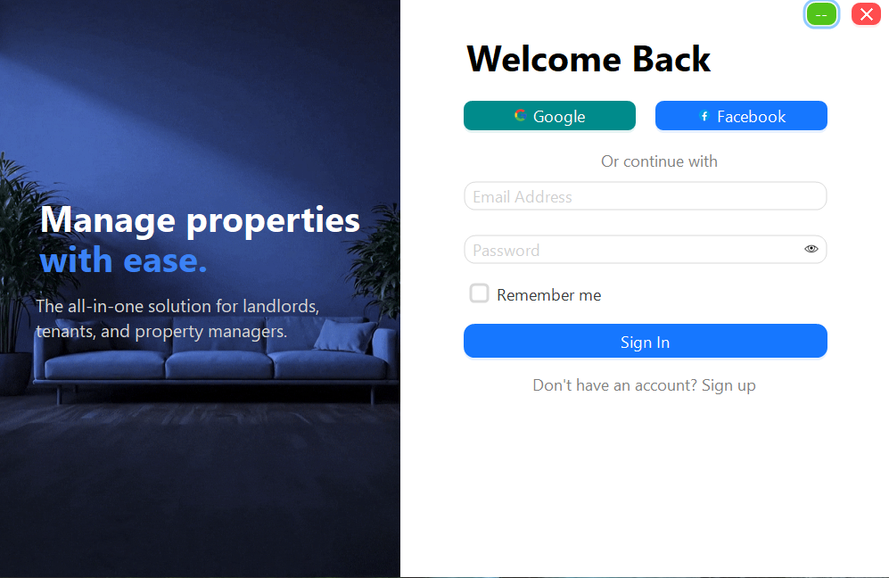
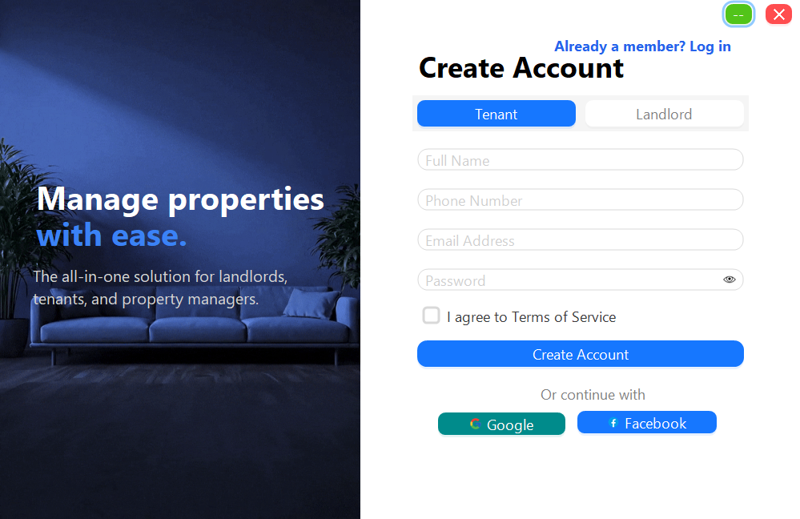

# 🏢 Rental Management System (RentalSystemUI)


A modern, high-performance desktop application for property management built with **C# Windows Forms** and **AntdUI**.
This project features a clean, flat architecture with role-based authentication for **Landlords** and **Tenants**.

---

## 🎥 Project Demonstration

Click the image below to watch the full video demonstration of the Rental Management System in action!

[](https://www.youtube.com/watch?v=HIJnsWYAU9U)

---

## 📚 Project Documentation

For a detailed breakdown of the system architecture, features, and methodology, check out the official project report:  
**[👉 View the Full Project Report Here](https://docs.google.com/document/d/1RLHymf69oI8pkkPEMiH5z1ez5_wfVrDeeSP5ldxhtD4/edit?usp=sharing)**

---

## 📸 Screenshots

<p align="center">
  
  
</p>

---

## ✨ Key Features

* 🎨 **Modern UI/UX** — Built using **AntdUI** for smooth animations, rounded corners, and flat design
* 🔐 **Role-Based Access** — Separate Sign-Up flows for **Tenants** and **Landlords**
* 🔄 **Seamless Navigation** — Single-window panel switching (no popup clutter)
* 📱 **Phone & Email Validation** — Robust input validation
* 💾 **Database Ready** — Uses `Microsoft.Data.SqlClient`
* ✨ **Visual Polish** — Transparent overlays, background images, draggable window

---

## 🛠️ Tech Stack

* **Language:** C#
* **Framework:** .NET 8.0 (Windows Forms)
* **UI Library:** [AntdUI](https://antdui.com/)
* **Database:** Microsoft SQL Server
* **IDE:** Visual Studio 2022

---

## 🚀 Getting Started

### Prerequisites

* Visual Studio 2022 (with **.NET Desktop Development** workload)
* .NET 8.0 SDK

---

### 1️⃣ Clone the Repository

```bash
git clone [https://github.com/Zul-Qarnain/RentalSystemUI.git](https://github.com/Zul-Qarnain/RentalSystemUI.git)
cd RentalSystemUI
```

---

### 2️⃣ Open in Visual Studio

Double-click the **`RentalSystemUI.sln`** file.

---

### 3️⃣ Install Dependencies (Important)

#### Using NuGet UI

1. Go to **Tools → NuGet Package Manager → Manage NuGet Packages for Solution**
2. Click **Restore**, or install manually:

| Package Name             | Version | Purpose                 |
| ------------------------ | ------- | ----------------------- |
| AntdUI                   | Latest  | Modern UI Components    |
| Microsoft.Data.SqlClient | Latest  | SQL Server Connectivity |

#### Using Package Manager Console

```powershell
Install-Package AntdUI
Install-Package Microsoft.Data.SqlClient
```

---

### 4️⃣ Database Setup (Optional / Future)

* Install SQL Server
* Update connection string in:

  * `App.config`
  * or `Controllers/DatabaseHelper.cs` (Coming soon)

---

### 5️⃣ Run the Application

Press **F5** or click **Start** ▶️ in Visual Studio.

---

## 📂 Project Structure

```text
RentalSystemUI/
├── Assets/          # Images, Icons
├── Classes/         # Data Models (User.cs, Property.cs)
├── Controllers/     # Business Logic & DB Helpers
├── Forms/           # UI Screens
├── Program.cs       # Application Entry
└── RentalSystemUI.sln
```

---

## 🤝 Contributing

1. Fork the project
2. Create a feature branch

   ```bash
   git checkout -b feature/AmazingFeature
   ```
3. Commit changes

   ```bash
   git commit -m "Add AmazingFeature"
   ```
4. Push branch

   ```bash
   git push origin feature/AmazingFeature
   ```
5. Open a Pull Request

---

## 📄 License

This project is licensed under the **MIT License** — see the `LICENSE` file.

---

### 👨‍💻 Development Team

* **Lead & Main Developer:** [Mohammad Shihab Hossain](https://github.com/Zul-Qarnain)
* **Contributor:** [Sanjihan Jaman Shuchi](https://github.com/shuchi171)
* **Contributor:** [MD.Naimul Haque Tashin](https://github.com/Tashin90)
